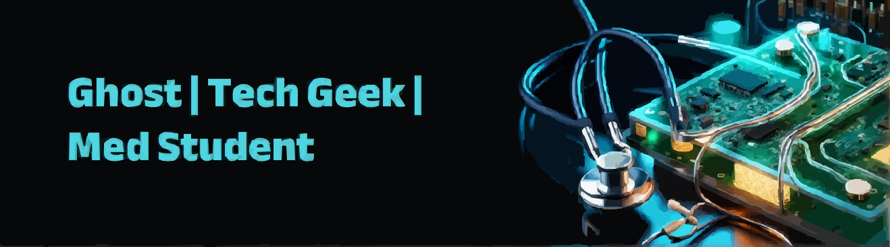

<h1 align="center">👋 Hey, I'm Aryan Bhatt</h1>
 

 
<h2 align="center">Tech Geek • Medical Student • Creative Coder • Music Enthusiast</h2>

---

## 👑 About Me

👨‍⚕️ Medical student passionate about tech, innovation, and creative coding  

🎮 Game dev enthusiast (check out my arcade bundle!)
 
🔒 Cybersecurity curious — always exploring system internals  

**Current Focus:**  
Exploring innovative solutions at the intersection of tech and healthcare.

Clone  
Add  
Commit  
Push  

---

## 📌 Featured Projects

 
🎮 <strong>Python Arcade Bundle</strong>
 <ul> <li>Includes Space Invaders, Brick Breaker like retro games.</li> <li>Uses Pygame with full scorekeeping and UI</li> </ul> 

---

## 📊 GitHub Stats

---

## 🚀 Tech Stack

| **Category**        | **Technologies & Tools**                                                                                      |
|---------------------|-------------------------------------------------------------------------------------------------------------|
| **Programming Languages**       |           |
| **Scripting Languages** |     |
| **Frameworks**      |     |
| **Tools & Platforms** |           |
| **Areas of Interest** | Cybersecurity, Artificial Intelligence, Automation, Game Development, UI/UX Design |

---

 
 

---

## 📫 Let’s Connect

Have ideas, feedback, or just want to geek out over tech?
I’m always open to collaboration, discussion, and learning.

## 📬 Email itsaryanbhatt@gmail.com

Thanks for dropping by! 
Consider leaving a ⭐ on a repo if you find something interesting!

---

  

